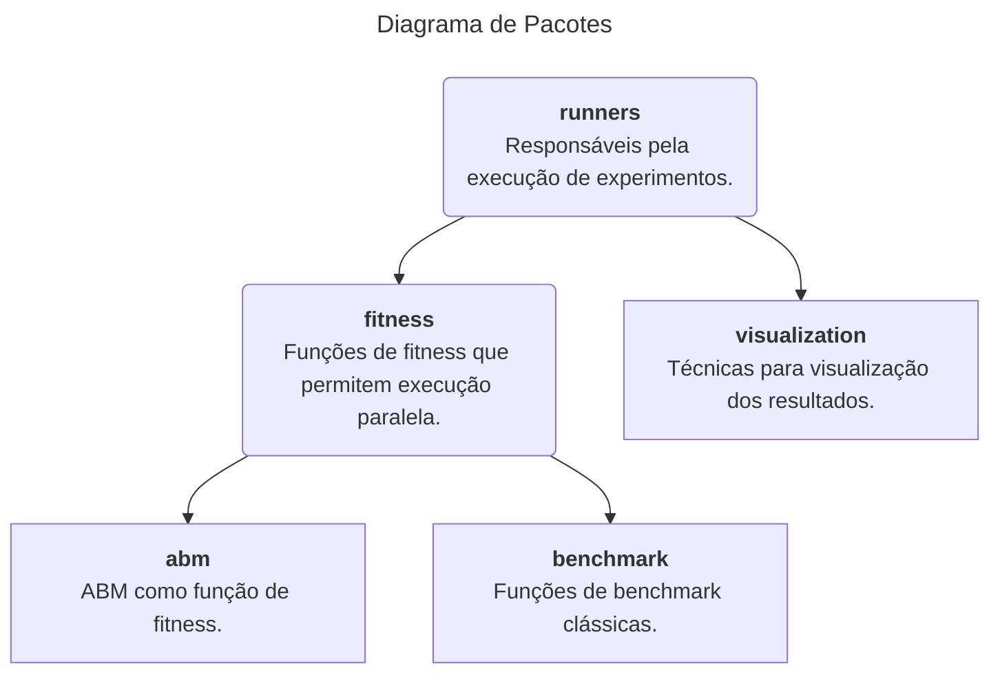

# Py-ABM: Biblioteca para calibração de ABMs através de Algoritmos evolucionários

Esse repositório contém a biblioteca `Py-ABM`, que provê funcionalidades para calibração de ABMs através de algoritmos evolucionários multi-objetivos. O intuito principal da biblioteca é calibrar os parâmetros do ABM ["An Integrative Decision-Making Mechanism for Consumers’ Brand Selection using 2-Tuple Fuzzy Linguistic Perceptions and Decision Heuristics"](https://link.springer.com/article/10.1007/s40815-022-01385-x), todavia ela é organizada de forma flexível para suportar diferentes funções de fitness e algoritmos de otimização.

## Organização do repositório

- [src](src/): contém o código fonte da biblioteca;
- [experiments](experiments/): contém scripts e códigos para realização de experimentos;
- [pyproject.toml](pyproject.toml): definição da estrutura da biblioteca;

## Arquitetura da Biblioteca

A biblioteca é organizada de forma simples, seguindo uma arquitetura com 2 camadas:

1. A camada de *Runners*, responsável pela execução de experimentos: composta pelo pacote *runners*.
2. A camada *Core*, que possui a definição de algoritmos e funções de fitness, e códigos de análise: composta pelos pacotes *fitness*, *visualization*.

Adicionalmente, um conjunto de entidades (interfaces, classes utilitárias, etc) é compartilhado entre todas as camadas do sistema.

